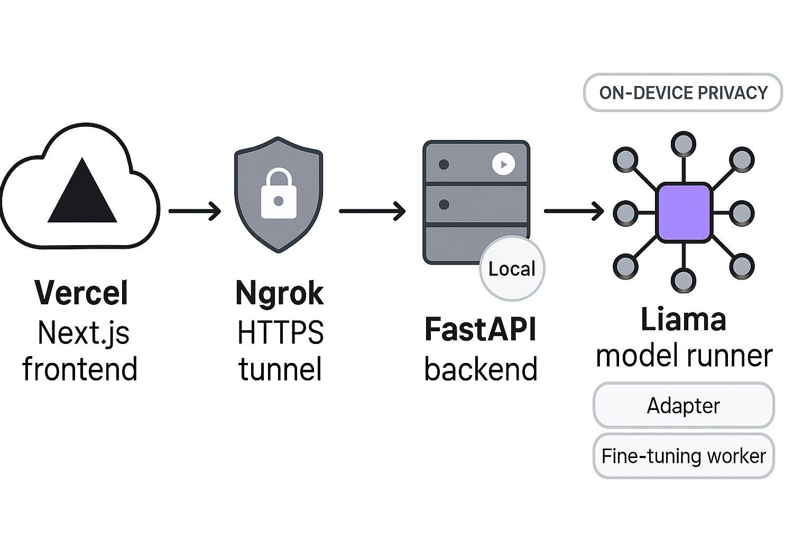

<!-- Banner / Hero -->

  

<h1 align="center">PrismBot — AI-Powered On‑Device Chatbot</h1>

  Privacy-first • Adapter‑driven • Smart fine‑tuning • Mobile‑ready

  
  
  
  
  
  

---

## ✨ Overview

PrismBot is an Active AI Powered Android Monitoring Overlay System that runs the LLAMA language model **fully on‑device**, keeping conversations and personal data private while delivering real‑time assistance through a sleek chat interface and **overlay mode**. Adapters enable instant role switching (study helper, coding buddy, travel guide, wellness coach), and **smart fine‑tuning** updates these adapters automatically when the device is idle/charging for an increasingly personalized experience.

  

---

## 🧩 Why PrismBot?

- Adapters for flexible roles (study, code, travel, wellness)  
- Smart background fine‑tuning during idle/charging  
- Overlay assistant available across apps  
- Strict on‑device privacy and encrypted storage  
- Mobile‑first UI with animated “Responding…” skeleton feedback

---

## 🏗️ Architecture

  

- Vercel‑hosted Next.js frontend calls the backend via a secure **Ngrok** HTTPS tunnel.  
- Local **FastAPI** backend orchestrates requests to on‑device **LLAMA** runner (Ollama/llama.cpp).  
- **Adapters** apply parameter‑efficient specialization; a **fine‑tuning worker** updates adapters when idle/charging.  
- All user data stays on device; personas are sandboxed to prevent cross‑contamination.

---

## 🛠️ Tech Stack

| Layer | Technology |
|------|------------|
| Frontend | Next.js, React, TypeScript, Tailwind CSS |
| Backend | FastAPI (Python) |
| Model Runner | llama.cpp / Ollama APIs |
| Fine‑Tuning | LoRA / QLoRA / Unsloth |
| Access & Overlay | Android Accessibility Service, Web Workers |
| Dev/Infra | Vercel, Ngrok |

---

## ⚙️ Setup & Run

### 1) Backend (Local)
cd src/backend
python -m venv .venv && source .venv/bin/activate # Windows: .venv\Scripts\activate
pip install -r requirements.txt
uvicorn main:app --host 127.0.0.1 --port 8000

### 2) Tunnel (Ngrok)
ngrok http 8000
copy the HTTPS forwarding URL, e.g. https://<id>.ngrok-free.app

### 3) Frontend
- In Vercel project settings, set:
  - `NEXT_PUBLIC_MOBILE_API_BASE = https://<your-ngrok>.ngrok-free.app`
  - cd src/frontend
  - npm install
  - npm run dev # local test
 

---

## 📖 User Guide

1. Open the web app and start chatting.  
2. Watch the animated “Responding…” skeleton as the assistant thinks.  
3. Enable **Overlay Mode** to float chat over other apps (Android).  
4. Switch roles with Adapters (study, code, travel, wellness).  
5. Fine‑tuning improves active adapters automatically when idle/charging.

  

---

## 🔐 Privacy & Ethics

- 100% on‑device inference and storage  
- No cloud data transfer required  
- Adapter/persona isolation prevents cross‑context leakage  
- Background jobs respect battery/thermal constraints

---

## 📚 Documentation

- Approach & Architecture: `docs/architecture-overview.md`  
- Technical Details: `docs/technical-docs.md`  
- Installation: `docs/installation-guide.md`  
- User Guide: `docs/user-guide.md`  
- Features: `docs/salient-features.md`

---

## 🧾 Attribution

- Next.js • FastAPI • Tailwind • Ngrok  
- LLAMA family (via llama.cpp / Ollama)  
- LoRA / QLoRA / Unsloth for PEFT  
- Thanks to the OSS community

---

## 🎬 Demo Video

  Built for <b>Samsung EnnovateX 2025 AI Challenge</b> — privacy‑first, adapter‑driven, and beautifully fast.

